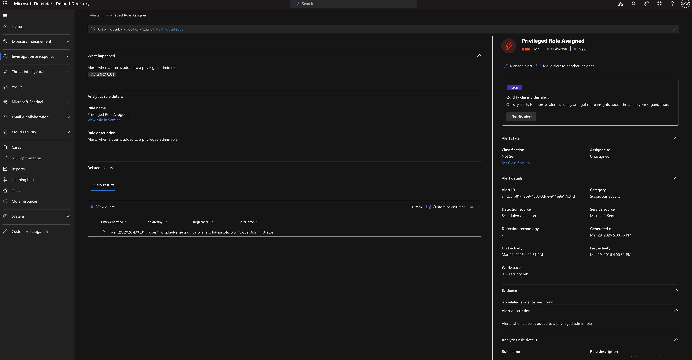

# Zero-Trust Azure Security Lab

A production-simulated cloud security environment built on Microsoft Azure, covering identity governance, automated threat detection, and incident response. All infrastructure provisioned via Terraform (IaC).

---

## Architecture Overview
```
┌─────────────────────────────────────────────────────┐
│                  Microsoft Azure                     │
│                                                      │
│  ┌─────────────────┐      ┌──────────────────────┐  │
│  │   Entra ID       │─────▶│  Microsoft Sentinel  │  │
│  │  (Identity)      │      │  (SIEM / Detection)  │  │
│  │                  │      │                      │  │
│  │  • 5 users       │      │  • 3 KQL rules       │  │
│  │  • RBAC roles    │      │  • Incident mgmt     │  │
│  │  • CAP policies  │      │  • Threat hunting    │  │
│  └─────────────────┘      └──────────────────────┘  │
│           │                                          │
│  ┌─────────────────┐                                 │
│  │   Terraform     │                                 │
│  │   (IaC)         │                                 │
│  │  • All infra     │                                 │
│  │    as code       │                                 │
│  └─────────────────┘                                 │
└─────────────────────────────────────────────────────┘
```

---

## What I Built

### 1 — Identity & Access Management (Entra ID)
- Provisioned 5 enterprise test users via Microsoft Graph API automation
- Enforced least-privilege RBAC — roles assigned only where operationally required
- Configured risk-based Conditional Access Policies enforcing MFA
- Secured service-to-service authentication using OAuth 2.0 / MSAL — no hard-coded secrets
- All Entra ID security groups and admin roles provisioned via Terraform

### 2 — SIEM & Threat Detection (Microsoft Sentinel)
- Deployed Microsoft Sentinel on Log Analytics Workspace
- Connected Entra ID sign-in logs, audit logs, and provisioning logs as data sources
- Authored 3 custom KQL analytics rules (see below)
- Simulated real attacks and confirmed end-to-end detection with forensic evidence
- Performed manual threat hunting across 7-day audit log windows

### 3 — Infrastructure as Code (Terraform)
- All Azure resources provisioned via Terraform — no manual portal clicks
- Enables repeatable, auditable, version-controlled deployments
- Aligned with CIS Azure Benchmark and NIST CSF controls

---

## Detection Rules

| Rule | Severity | Logic | Trigger |
|------|----------|-------|---------|
| Brute Force Sign-in Attempt | 🔴 High | 5+ failed sign-ins from same IP within 10 minutes | FailedAttempts >= 5 |
| Privileged Role Assigned | 🔴 High | Any user added to Global Admin, Security Admin, or equivalent | Role assignment detected in AuditLogs |
| Sign-in From Outside UK | 🟡 Medium | Successful authentication from non-GB location | Location != "GB" |

---

## Incidents Detected

### Incident 1 — Brute Force Attack
Simulated a password-guessing attack against a test account. Sentinel detected and raised a High severity incident within 10 minutes.

**Forensic evidence captured:**
- Target account: `alice.admin@macoforwork.onmicrosoft.com`
- Source IP: `93.114.63.232`
- Failed attempts: 6
- Detection time: within 10 minutes of attack


---

### Incident 2 — Privilege Escalation
Detected a user account being elevated to Global Administrator role.

**Forensic evidence captured:**
- Target account: `carol.analyst@macoforwork.onmicrosoft.com`
- Role assigned: Global Administrator
- Detection source: Scheduled KQL analytics rule
- Generated: Mar 29, 2026



---

## Threat Hunting

Beyond automated detection, performed manual KQL threat hunting to identify privilege escalation events across a 7-day window — simulating proactive SOC analyst work outside alert-driven investigation.

**Query used:**
```kusto
AuditLogs
| where TimeGenerated > ago(7d)
| where OperationName == "Add member to role"
| where Result == "success"
| extend TargetUser = tostring(TargetResources[0].userPrincipalName)
| extend RoleName = tostring(TargetResources[0].modifiedProperties[1].newValue)
| project TimeGenerated, InitiatedBy, TargetUser, RoleName
```

**Result:** Identified 3 privilege escalation events including two Global Administrator elevations.


---

## Incident Response Playbook

Documented a formal IR playbook for the brute force scenario covering triage, containment, investigation, recovery, and post-incident documentation.

See: [ir-playbook-bruteforce.md](sentinel/ir-playbook-bruteforce.md)

---

## Repository Structure
```
entra-id-project/
│
├── terraform/                    # All Azure IaC
│   ├── main.tf
│   ├── rbac.tf
│   └── conditional-access.tf
│
├── sentinel/
│   ├── analytics-rules/          # KQL detection rules
│   │   ├── brute-force-detection.kql
│   │   ├── privileged-role-assigned.kql
│   │   └── signin-outside-uk.kql
│   ├── screenshots/              # Incident evidence
│   └── ir-playbook-bruteforce.md
│
└── README.md
```

---

## Technologies

| Category | Tools |
|----------|-------|
| Cloud | Microsoft Azure |
| Identity | Entra ID (AAD) · RBAC · Conditional Access · MFA |
| SIEM | Microsoft Sentinel · Log Analytics · KQL |
| IaC | Terraform |
| Automation | Python · Microsoft Graph API · MSAL · OAuth 2.0 |
| Languages | Python · KQL · Bash · HCL |
